# Books
## Project 07 Android Basic Nano degree Schorlarship Udacity/Google

## Project Overview
You've made it to the end! This is the final part of project where you'll create a single amazing app that will pull together many of the components you've learned in this Nanodegree program!

The goal is to design and create the structure of an **Inventory App** 
which would allow a store to keep track of its inventory. In Stage 1, 
you designed and implemented the backend database that stores information
about the products and suppliers. In this stage, 
you'll build out the app UI for users to add and remove inventory.

## Why this project?
This is the capstone project of the Nanodegree program 
that allows you to demonstrate all the components you've 
learned throughout the program in a single final product.

Imagine that you are the Android developer at a merchandise startup, 
tasked with building out their inventory app. Consider the user workflow, 
user needs, and backend database storage needs as you plan.

You will need to pull together your knowledge of app planning,
navigating between multiple activities, databases, networking,
and UI development. A strong foundation in these skills are foundational to Android development worldwide. By practicing these skills and building this app, you will have the foundation to build similar apps for any kind of business.

## What will I Iearn?
In addition to skills covered in previous courses, 
this project is about combining various ideas and 
skills we’ve been practicing throughout the course. They include:

* Storing information in a SQLite database
* Integrating Android’s file storage systems into that database
* Setting up a Content Provider and use it to access a repository of data
* Presenting information from files and SQLite databases to users
* Updating information based on user input
* Creating intents to other apps using stored information

_Note: As the focus of this program is Java, only projects 
completed with Java as the source code will be accepted. 
Projects using Kotlin as the source code will not be accepted._

## Demo video:

https://www.youtube.com/watch?v=JlT3Z2kI5RE&t=4s

## Screenshots
Main Screen | Settings  | Add an book | Validation | Validation | Book saved |  
:---------: | :-------: | :---------: | :---------:| :---------:| :---------:| 
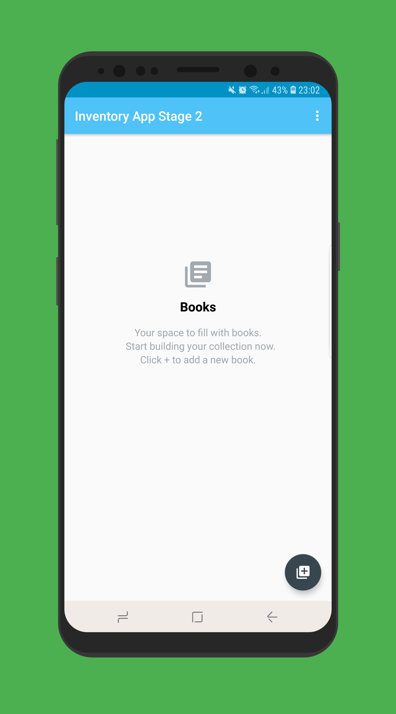 | 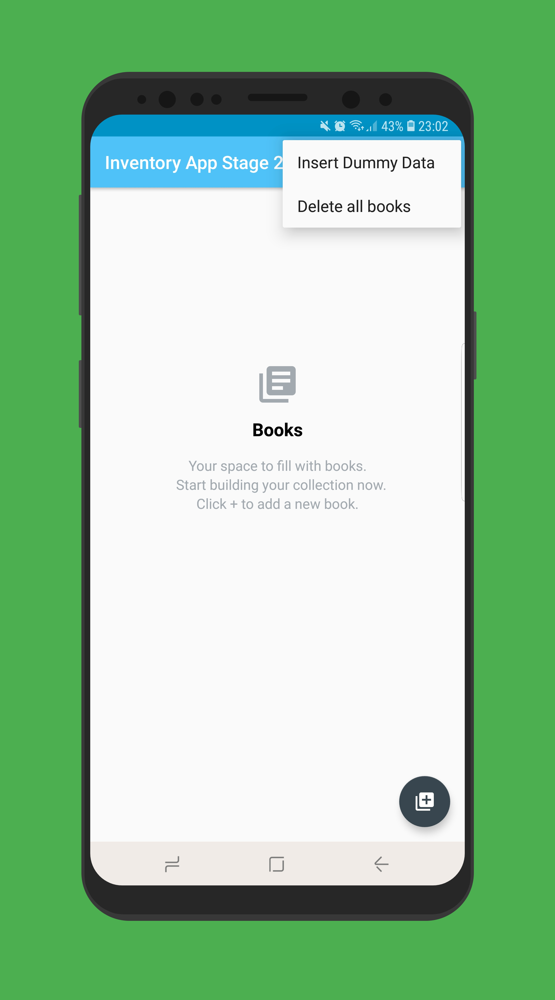 | 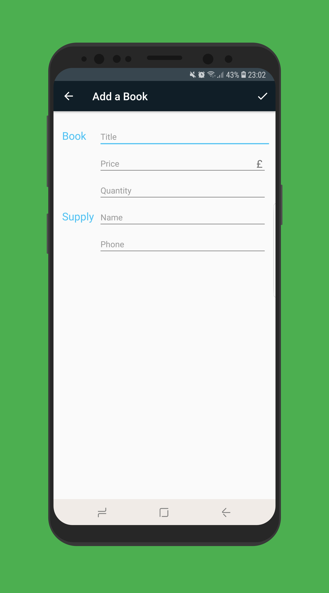 | 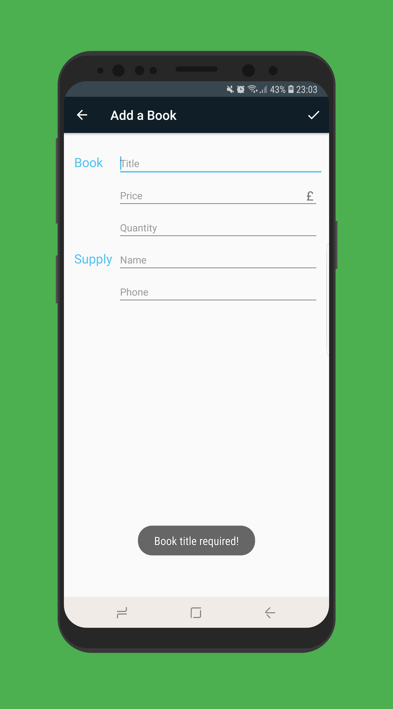 | 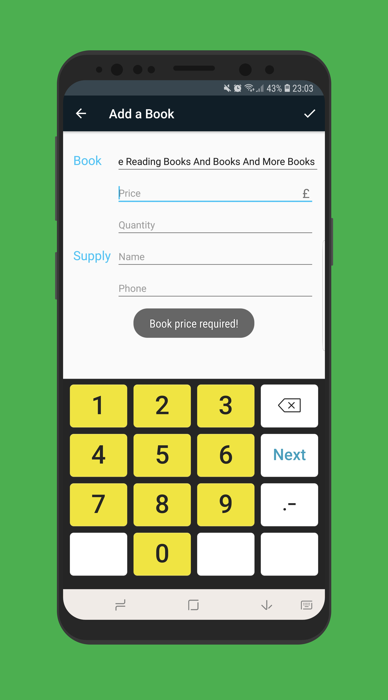 | 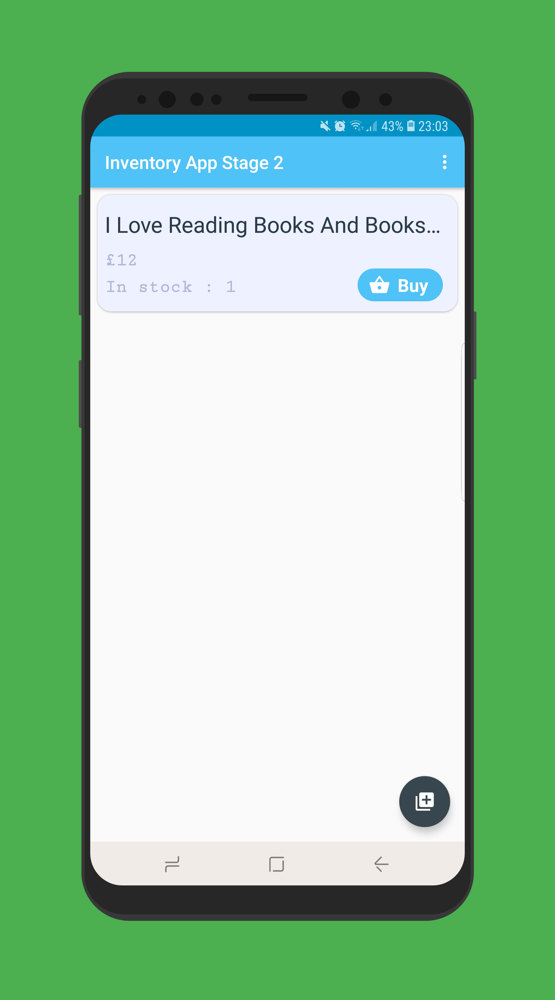 

Buy clicked | Instock = 0 | More books | Details Screen |
:----------:| :----------:| :---------:| :-------------:|
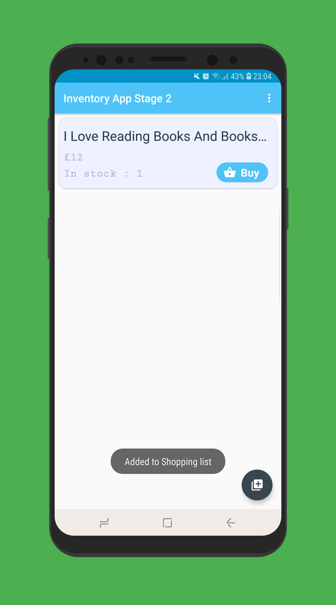 | 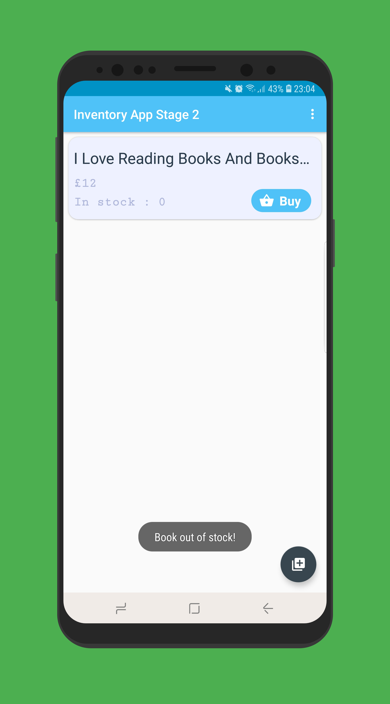 | 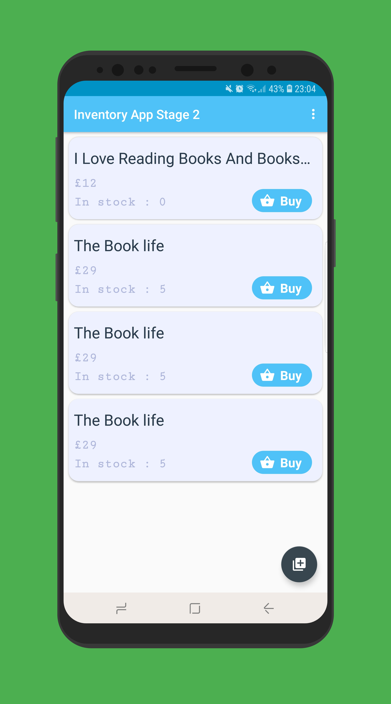 | 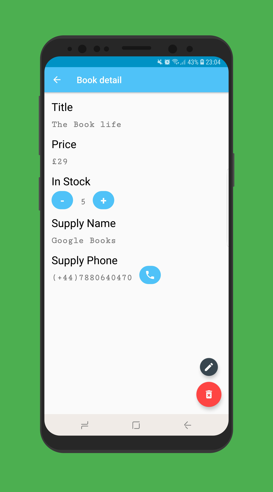

Plus Clicked | Minus Clicked | Instock = 0 | Delete Clicked | Edit Screen | Validation | Back Pressed |
:-----------:| :------------:| :----------:| :-------------:| :----------:| :---------:| :-----------:|
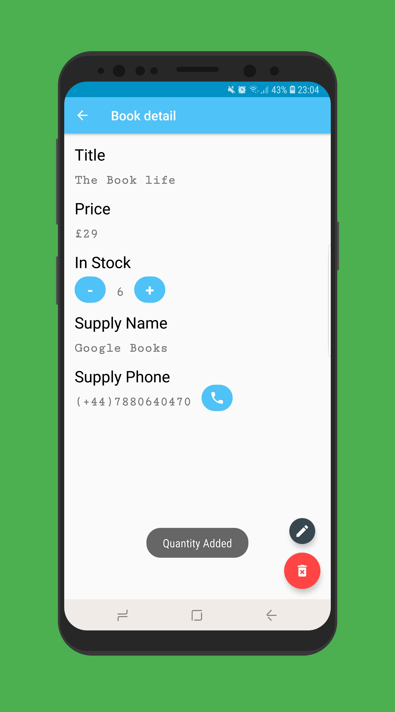 |  | 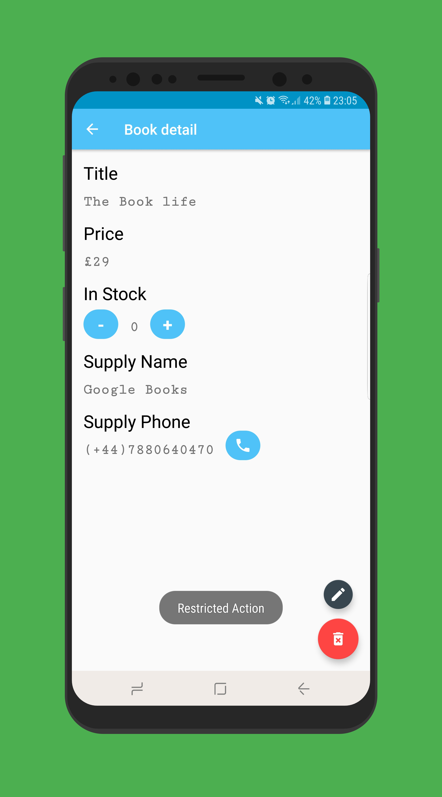 | 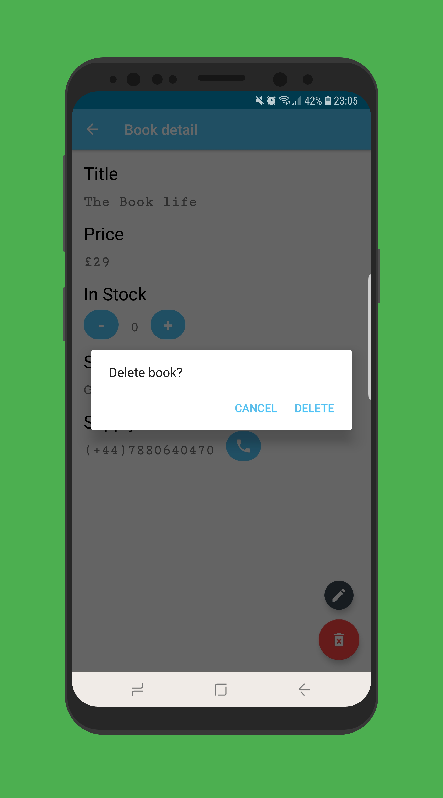 | 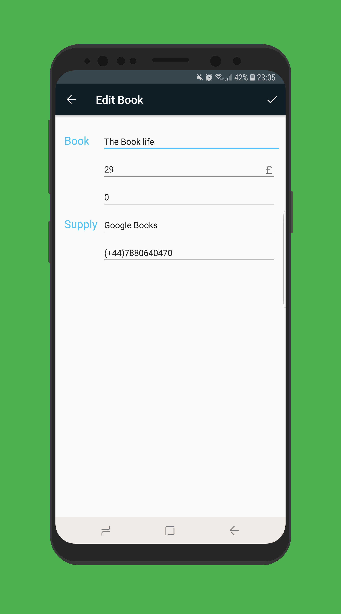 | 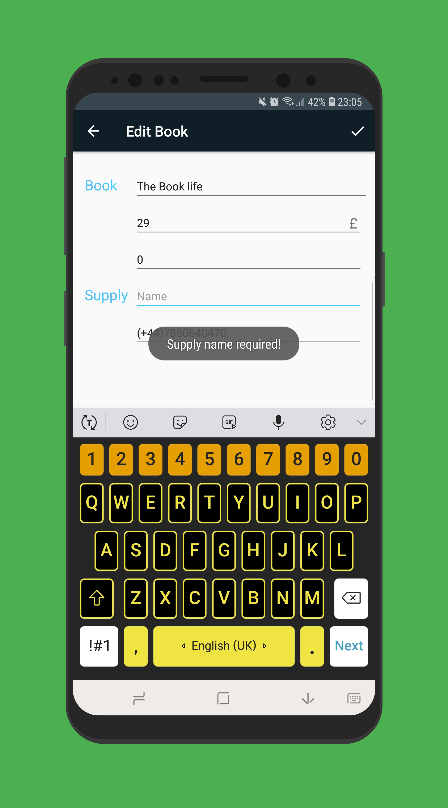 | 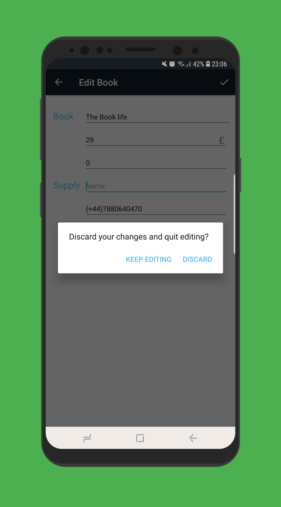 

### Made by 2ms
